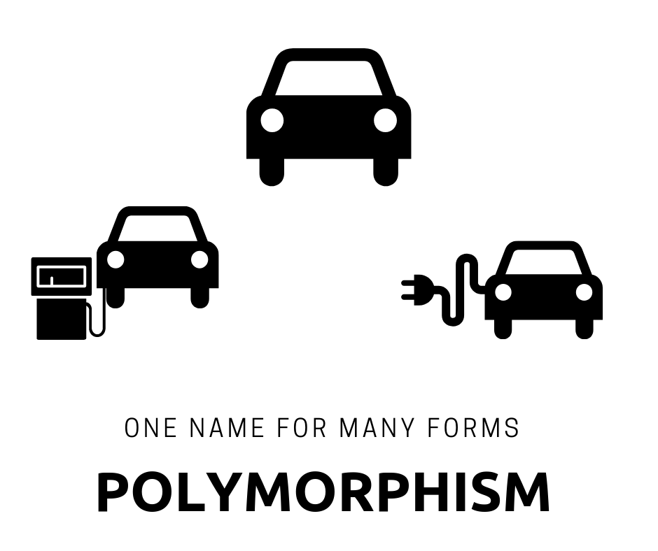

# Object-Oriented programming (C#)

- Abstraction Modeling the relevant attributes and interactions of entities as classes to define an abstract representation of a system.
- Encapsulation Hiding the internal state and functionality of an object and only allowing access through a public set of functions.
- Inheritance Ability to create new abstractions based on existing abstractions.
- Polymorphism Ability to implement inherited properties or methods in different ways across multiple abstractions.

## inheritance 
Inheritance is a mechanism of basing an object or class upon another object or class, retaining similar implementation. Inheritance allows you to re-use functionality that is already implemented in another class, and also to add custom logic on top of it.

To avoid duplication in the class Cat , we can use inheritance 

```c#
class Pet
{
    public string Name { get; set; }

    public void PrintName()
    {
        Console.WriteLine($"My name is {Name}");
    }
}

class Cat : Pet     // Class Cat derives from the class Pet
{
    public string Breed { get; set; }

    public void PrintBreed()
    {
        Console.WriteLine($"My breed is {Breed}");
    }
}

public class ClassWithMain
{
    public static void Main()
    {
        Cat mrMartin = new Cat
        {
            Name = "mr Martin", // Property Name is derived from the class Pet
            Breed = "Siamese"
        };

        mrMartin.PrintName();  // PrintName is derived from the class Pet
        mrMartin.PrintBreed();
    }
}
// Outputs:
// My name is mrMartin
// My breed is Siamese

```

When you re-use the functionality of one class in another one by using inheritance, you are deriving one class from another. The class whose members are inherited is called the base class , and the class that inherits those members is called the derived class . A derived class can have only one direct base class. In our example, class Pet is the base class and the class Cat is a derived one. To derive class A from class B, use a colon (:) after the class A name, and then append the name for class B. You can treat it as a copy of the code from the class B to class A.

In the example above, we derived class Cat from class Pet . Having done that, we can now use the property Name and the method PrintName on every object of type Cat .

As you can see, there is no code duplication when you use inheritance . It all happens behind the scenes.


Conceptually, the connection between classes that are represented by inheritance can be thought of as an " is " relationship. A derived class is a specialization of the base class. In our example: a cat is a pet; that's why Cat derives from Pet . Beginners often wonder when one class should or should not derive from another one. A good check would be to apply the "is" rule. If one of them "is" another, you can apply inheritance, otherwise - don't. Here are some more examples:

Minivan derives from Vehicle . This is the proper usage of inheritance: a minivan is a vehicle.

Student derives from Pet . This is NOT a proper usage of inheritance. A student is NOT a Pet, even though they both have names.

Inheritance is transitive. This means if B is derived from C , and A is derived from B , then A is also derived from C :

```c#

class C
{
    public void PrintCName()
    {
        Console.WriteLine("I'm class C");
    }
}

class B : C
{
    public void PrintBName()
    {
        Console.WriteLine("I'm class B");
    }
}

class A : B
{
    public void PrintAName()
    {
        Console.WriteLine("I'm class A");
    }
}

public class ClassWithMain
{
    public static void Main()
    {
        var a = new A();

        a.PrintAName();
        a.PrintBName(); // Inherited from class B
        a.PrintCName(); // Inherited from class C
    }
}
// Outputs:
// I'm class A
// I'm class B
// I'm class C

```

it is NOT possible to derive a class from more than one class .

## polymorphism



The ability to work with different classes via the same interface is called polymorphism.

```C#

public interface ICar
{
    void Accelerate();
}

public class ElectricCar : ICar
{
    public void Accelerate()
    {
        Console.WriteLine($"Accelerating an electric car.");
    }
}

public class PetrolCar : ICar
{
    public void Accelerate()
    {
        Console.WriteLine($"Accelerating a petrol car.");
    }
}

public class Driver
{
    public static void Main()
    {
        ElectricCar electricCar = new ElectricCar();
        PetrolCar petrolCar = new PetrolCar();

        AccelerateCar(electricCar);
        AccelerateCar(petrolCar);
    }

    // Accelerates any car that implements ICar!!!
    private static void AccelerateCar(ICar car) // <-- Magic!
    {
        car.Accelerate();
    }
}

// Outputs:
// Accelerating an electric car.
// Accelerating a petrol car.

```

Polymorphism works in such a way that every object stores a reference to its original type

 you can assign an object of a child class to a variable of the parent class. Here's a code example:"

 ```c#

 public class Car
{
    public virtual void Accelerate()
    {
        Console.WriteLine("Accelerating an unknown car");
    }
}

public class ElectricCar : Car
{
    public override void Accelerate()
    {
        Console.WriteLine("Accelerating an electric car.");
    }
}

public class PetrolCar : Car
{
    public override void Accelerate()
    {
        Console.WriteLine("Accelerating a petrol car.");
    }
}

public class Driver
{
    public static void Main()
    {
        ElectricCar electricCar = new ElectricCar();
        PetrolCar petrolCar = new PetrolCar();

        AccelerateCar(electricCar);
        AccelerateCar(petrolCar);
    }

    // Accelerates any car that derives from Car!!!
    private static void AccelerateCar(Car car)
    {
        car.Accelerate();
    }
}

// Outputs:
// Accelerating an electric car.
// Accelerating a petrol car.

 ```

 ```C#

Car car1 = new Car();
Car car2 = new ElectricCar();
Car car3 = new PetrolCar();
```

```C#
Because of polymorphism, C# calls the right method for each class, as we saw in the method AccelerateCar in previous examples. "

public class Car
{
    public virtual void Accelerate()
    {
        Console.WriteLine("Accelerating an unknown car.");
    }
}

public class ElectricCar : Car
{
    public override void Accelerate()
    {
        Console.WriteLine("Accelerating an electric car.");
    }
}

public class PetrolCar : Car
{
    public override void Accelerate()
    {
        Console.WriteLine("Accelerating a petrol car.");
    }
}

public class Driver
{
    public static void Main()
    {
        Car car1 = new Car();
        Car car2 = new ElectricCar();
        Car car3 = new PetrolCar();

        car1.Accelerate(); // C# knows that it should call Accelerate from
                           // Car
        car2.Accelerate(); // C# knows that it should call Accelerate from
                           // ElectricCar
        car3.Accelerate(); // C# knows that it should call Accelerate from
                           // PetrolCar
    }
}

// Outputs:
// Accelerating an unknown car.
// Accelerating an electric car.
// Accelerating a petrol car.

```

##Encapsulation

is one of the fundamental concepts in object-oriented programming. Encapsulation has two goals:

1- Keeping the data, and methods for working with the data, in one unit (such as a class or struct in C#)

2- Restricting direct access to some of the unit's components

```C#

class Car
{
    public decimal Price { get; }
    public int Discount { get; }

    public Car(decimal price, int discount)
    {
        Price = price;
        Discount = discount;
    }

    public void PrintPrice()
    {
        Console.WriteLine($"Car costs {Price}");
    }

    public void PrintDiscountPrice()
    {
        Console.WriteLine($"Price with discount is {Price - Discount}");
    }
}

class SomeOtherClass
{
    public static void Main()
    {
        var carPrice = decimal.Parse(Console.ReadLine());
        var carDiscount = int.Parse(Console.ReadLine());

        var car = new Car(carPrice, carDiscount);

        car.PrintPrice();
        car.PrintDiscountPrice();
    }
}

```

the first encapsulation concept: to keep data and methods that work with that data in one class. Class Car contains data fields Discount and Price , as well as the methods that work with those, PrintPrice and PrintDiscount


In general, Public fields are usually not welcome in C#. Public fields expose the inner state of your class, allowing anyone to change it

## Inheritance

Inheritance is a mechanism of basing an object or class upon another object or class, retaining similar implementation. Inheritance allows you to re-use functionality that is already implemented in another class, and also to add custom logic on top of it

## Abstract 

polymorphism is used when you have different derived classes with the same method, which has different implementations in each class. This behavior is achieved through virtual methods that are overridden in the derived classes.

In some situations there is no meaningful need for the virtual method to have a separate definition in the base class.

These methods are defined using the abstract keyword and specify that the derived classes must define that method on their own. 

You cannot create objects of a class containing an abstract method, which is why the class itself should be abstract.


Remember, abstract method declarations are only permitted in abstract classes. Members marked as abstract, or included in an abstract class, must be implemented by classes that derive from the abstract class. An abstract class can have multiple abstract members.

An abstract class is intended to be a base class of other classes. It acts like a template for its derived classes.

Now, having the abstract class, we can derive the other classes and define their own Draw() methods: 

```C#

class Program
    {
        abstract class Shape {
            public abstract void Draw();
        }
        class Circle : Shape {
            public override void Draw() {
                Console.WriteLine("Circle Draw");
            }
        }
        class Rectangle : Shape {
            public override void Draw() {
                Console.WriteLine("Rect Draw");
            }
        }
        static void Main(string[] args)
        {
            Shape c = new Circle();
            c.Draw();
        }
    }

```

Abstract classes have the following features:

- An abstract class cannot be instantiated.

- An abstract class may contain abstract methods and accessors.

- A non-abstract class derived from an abstract class must include actual implementations of all inherited abstract methods and accessors.


It is not possible to modify an abstract class with the sealed modifier because the two modifiers have opposite meanings. The sealed modifier prevents a class from being inherited and the abstract modifier requires a class to be inherited.


