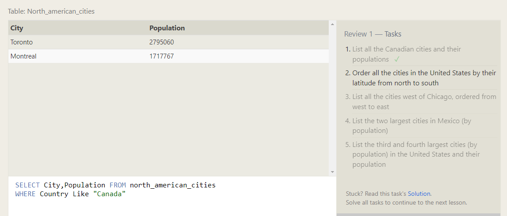
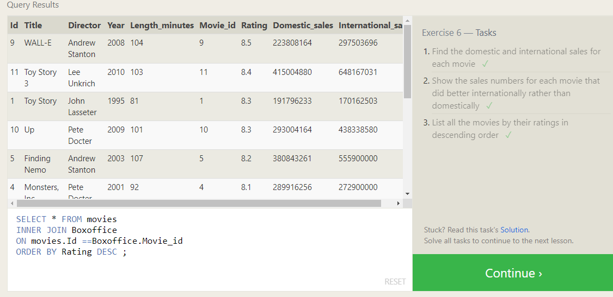

# Summary of Relational Databases and SQL Understanding

In this prework, I embarked on a journey to learn about relational databases and SQL. Here is a summary of my understanding and progress:

## Learn SQL E-book

I downloaded the free e-book, "Learn SQL," and skimmed through its contents. The book provided a comprehensive introduction to SQL and relational databases, covering important concepts such as tables, relationships, and querying data.

## SQL Bolt Tutorials

I completed two sets of tutorials on SQL Bolt, focusing on SQL Queries and Database Management:

### SQL Queries (Lessons 1-6)

In this section, I learned how to write SQL queries to retrieve data from tables. I practiced using the SELECT statement, filtering results with WHERE clauses, sorting data, and performing joins. These exercises helped me gain confidence in constructing effective queries.

### Database Management (Lessons 13-18)

The Database Management tutorials delved into advanced topics related to managing databases. I learned about creating tables, altering their structure, and deleting them. Additionally, I explored concepts such as primary keys, foreign keys, and data integrity constraints. These lessons provided valuable insights into maintaining and organizing databases effectively.

## Summary of Understanding

Through this prework, I have developed a strong understanding of relational databases and SQL. I now grasp the fundamentals of working with tables, querying data, and managing databases. The practical exercises in the SQL Bolt tutorials have been instrumental in solidifying my knowledge and skills.

Here is the screenshot of the completed task list from the SQL Queries section:

